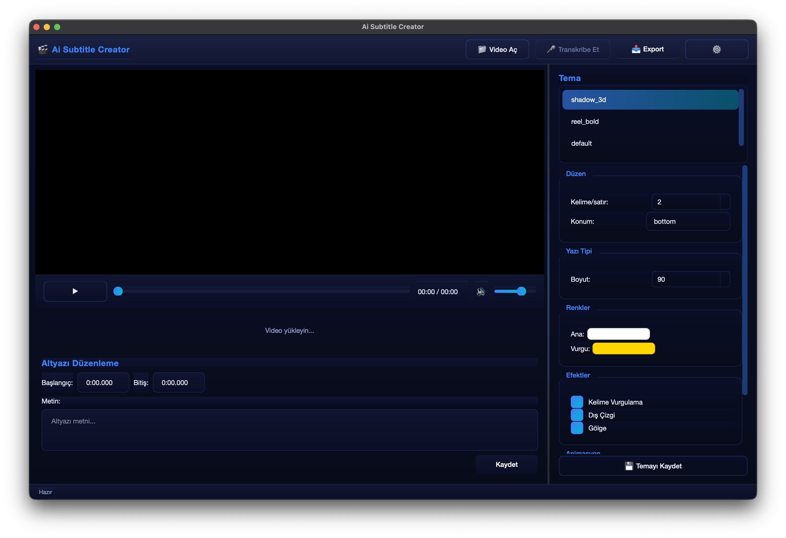

# 🎬 Ai Subtitle Creator


**Ai Subtitle Creator** is a modern, AI-powered desktop application for automatically generating and styling subtitles for your videos. It uses OpenAI's Whisper model to transcribe audio with high accuracy and provides a rich interface for editing, styling, and exporting subtitles.




## ✨ Features

- **🤖 AI-Powered Transcription**: Uses OpenAI's Whisper models (Tiny to Large) for accurate speech-to-text.
- **🖥️ Modern GUI**: Clean, dark-themed interface built with PyQt6.
- **🎨 Advanced Theming**: 
  - Choose from built-in themes (Shadow 3D, Karaoke, Reel Bold, etc.).
  - Customize fonts, colors, outlines, shadows, and animations.
  - Real-time preview of subtitle styles.
- **📝 Subtitle Editor**: 
  - Edit text and precise timing on a timeline.
  - Visual timeline for easy navigation.
- **📹 Live Preview**: Watch your video with subtitles overlayed in real-time before exporting.
- **💾 Multiple Export Options**: 
  - Export as `.mp4` (burned-in subtitles).
  - Export as `.srt` or `.ass` subtitle files.
- **🌍 Multi-language Support**: Supports transcription in multiple languages (English, Turkish, German, French, etc.).

## 🚀 Installation

### Prerequisites

- Python 3.8 or newer
- [FFmpeg](https://ffmpeg.org/) installed and added to your system PATH.

  **FFmpeg Installation:**
  
  <details>
  <summary>Click to see installation commands</summary>

  **Ubuntu/Debian:**
  ```bash
  sudo apt update && sudo apt install ffmpeg
  ```

  **macOS (Homebrew):**
  ```bash
  brew install ffmpeg
  ```

  **Windows (Chocolatey):**
  ```powershell
  choco install ffmpeg
  ```
  *(Or download from [ffmpeg.org](https://ffmpeg.org/download.html) and add `bin` folder to Path)*
  </details>

### Installation Methods

#### Option 1: Quick Install (via pip)

Install directly from GitHub:

```bash
pip install git+https://github.com/Tuguberk/ai-subtitle-creator.git
```

Then run the application:
```bash
ai-subtitle
```

#### Option 2: Manual Setup (Development)

1. Clone the repository:
   ```bash
   git clone https://github.com/tuguberk/ai-subtitle-creator.git
   cd ai-subtitle-creator
   ```

2. Install the required dependencies:
   ```bash
   pip install -r requirements.txt
   ```

3. Run the application:
   ```bash
   python run_gui.py
   ```
   *Or install in editable mode and run via command line:*
   ```bash
   pip install -e .
   ai-subtitle
   ```

## 🛠️ Usage

1. **Open Video**: Click "Video Aç" to load your video file.
2. **Download Model**: On first run, select a Whisper model to download (e.g., Small or Medium).
3. **Transcribe**: Click "Transkribe Et". The AI will process the audio.
4. **Edit & Style**: 
   - Use the right panel to change themes, colors, and animations.
   - Edit subtitle text and timings in the bottom panel.
5. **Export**: Click "Export" to save your video with burned-in subtitles or as a subtitle file.

## 🤝 Credits

Created by [tuguberk](https://tuguberk.dev).

Based on the original auto-subtitle concept but completely rewritten as a full GUI application.

## 📄 License

This project is open-source and licensed under the MIT License.
